 **Exploring images** *with* *Open-CV2*

**Getting images and it's properties**


```python
# opencv image library 
import cv2
from google.colab.patches import cv2_imshow

giraffe_image = cv2.imread("images/giraffe.jpg")

# it's dimension w, h, l
print(giraffe_image.shape, "\n")

# showing image
cv2_imshow(giraffe_image)
```

    (750, 500, 3) 
    


    
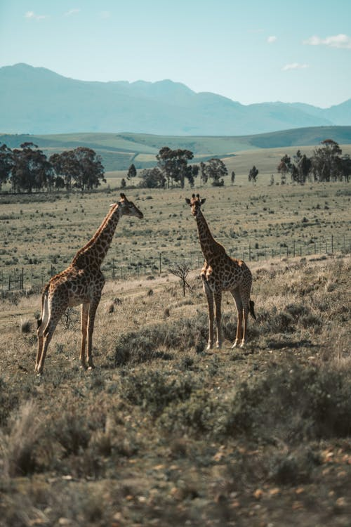
    


**Changing color of the image**

Grey Scale


```python
blackwhite = cv2.cvtColor(giraffe_image, cv2.COLOR_BGR2GRAY)

print(blackwhite.shape,"\n")

cv2_imshow(blackwhite)
```

    (750, 500) 
    


    
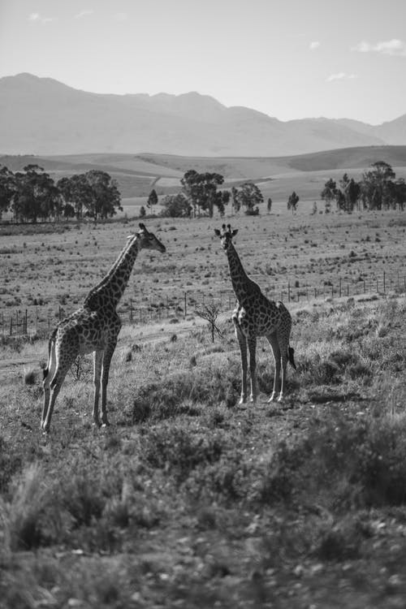
    


Hue saturation


```python
hsv = cv2.cvtColor(giraffe_image,cv2.COLOR_BGR2HSV)

print(hsv.shape,"\n")

# radiated image
cv2_imshow(hsv)
```

    (750, 500, 3) 
    


    
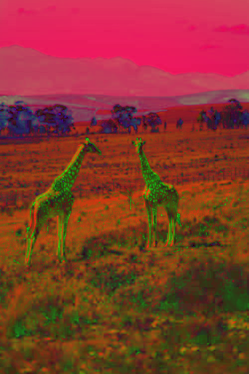
    


**Edge detection**


```python
#include new image
angelfall_image = cv2.imread("images/water.jpeg")
cv2_imshow(angelfall_image)
```


    
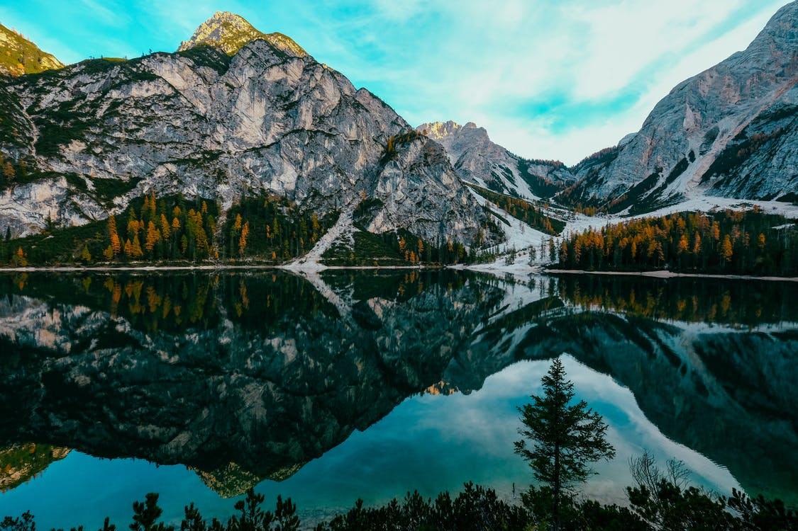
    


```python
#converting to grey scale for edge detection

grey = cv2.cvtColor(angelfall_image, cv2.COLOR_BGR2GRAY)
canny_img = cv2.Canny(grey, 150, 200)

cv2_imshow(canny_img)
```


    
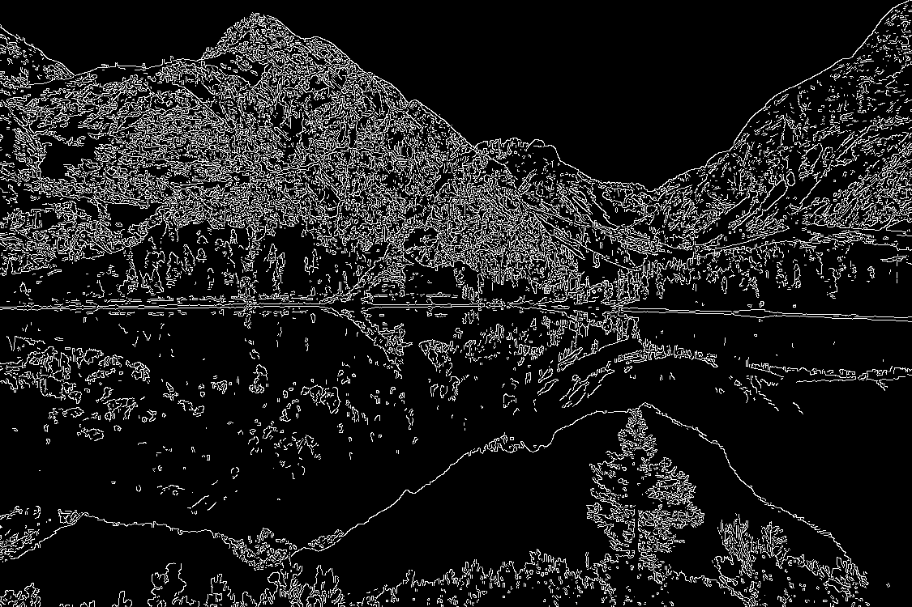
    


**Errosion** - decreasing brightness of the grayscale image and removing unwanted pixels


```python
import numpy as np

kernel = np.ones((1, 1), np.uint8)
erode_img = cv2.erode(canny_img, kernel, iterations = 1)
cv2_imshow(erode_img)
```


    

    


**Dialation** - expanding pixels of the images


```python
kernel = np.ones((2, 2), np.uint8)

dilate_img = cv2.dilate(canny_img,  kernel, iterations = 1)

cv2_imshow(dilate_img)
```


    

    


```python
import numpy as np
display = np.hstack(( canny_img,  erode_img, dilate_img))
            #vstack
cv2_imshow(display)
```


    
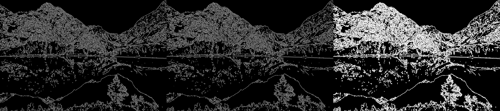
    


**Image manupilations**


```python
import cv2
import numpy as np
from google.colab.patches import cv2_imshow

lion_image = cv2.imread("images/lion.jpeg")

#roaring sound cancellation by applying noise filteration on image
dst = cv2.fastNlMeansDenoisingColored(lion_image, None, 20, 20,7,15)

display_l = np.hstack((lion_image, dst))

# image noise removal
cv2_imshow(display_l)
```


    
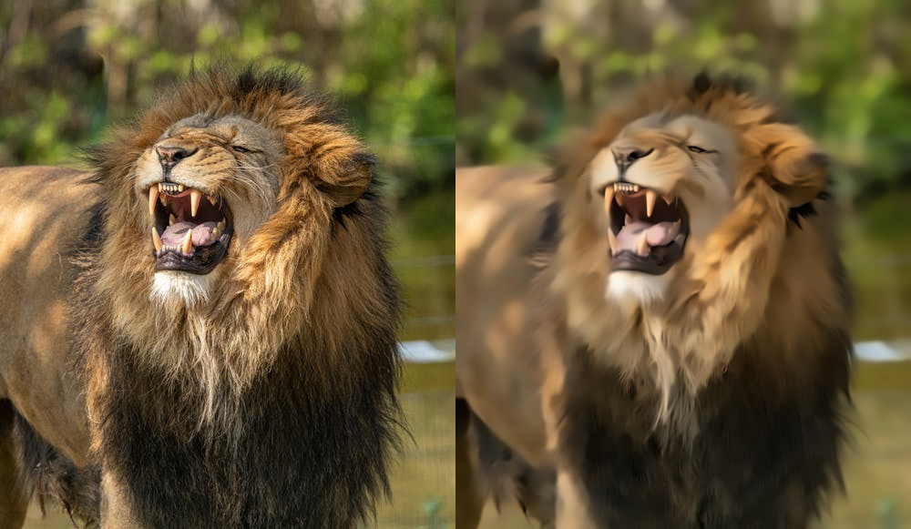
    


**Creating, making shapes and writing text on image**


```python
import cv2
import numpy as np
from google.colab.patches import cv2_imshow

# creating image of 720x1080 pixels
drawing_img = np.zeros((420, 990, 3), np.uint8)

#text
cv2.putText(drawing_img, "All shapes are below",(55, 55), cv2.FONT_HERSHEY_COMPLEX, 2,(0, 255, 0),2)

#circle
cv2.circle(drawing_img, (200, 200), 100,(0, 0, 255), 8)

#rectangle
cv2.rectangle(drawing_img, (350, 300), (650,100), (255, 0, 0), 8)

#line
cv2.line(drawing_img, (700, 100), (900, 300), (0, 238, 255), 8)

cv2_imshow(drawing_img)
```


    
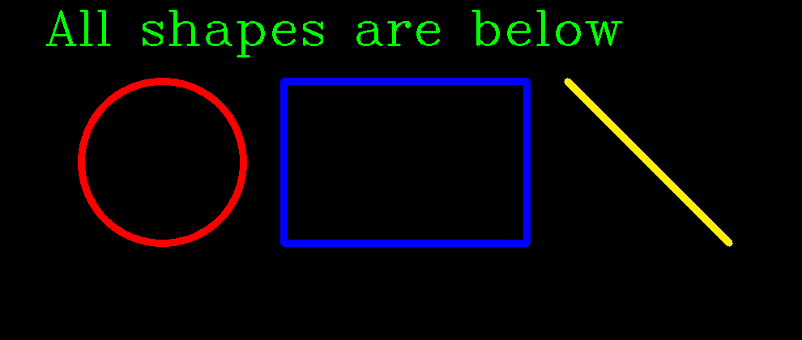
    


**Tracking an object from the video file**


```python
#random object like moving circle fastly, creating from animation software
# export as .mp4 and track it by this code in google colab
import cv2
import numpy as np
from google.colab.patches import cv2_imshow

ball = []
capture = cv2.VideoCapture("videos/Object.mp4")
out = cv2.VideoWriter("videos/Output.avi", cv2.VideoWriter_fourcc('M', 'J', 'P', 'G'), 10, (1080, 720))
while capture.isOpened():
  ret, frame = capture.read()
  if ret is False:
    break
  hsv = cv2.cvtColor(frame, cv2.COLOR_BGR2HSV)
  lower_hue = np.array([21,0,0])
  upper_hue = np.array([45,255,255])
  mask = cv2.inRange(hsv, lower_hue, upper_hue)

  (contours,_) = cv2.findContours(mask,cv2.RETR_TREE, cv2.CHAIN_APPROX_SIMPLE)

  center = None

  if len(contours) > 0:
    C = max(contours, key=cv2.contourArea)
    ((x, y), radius) = cv2.minEnclosingCircle(C)
    M = cv2.moments(C)
    try:
      center = (int(M["m10"]/M["m00"]), int(M["m01"]/M["m00"]))
      cv2.circle(frame, center, 10, (255, 0,0), -1)
      item.append(center)
    except:
      pass
    if len(item) > 2:
      for i in raange(1, len(item)):
        cv2.line(frame, item[i-1], item[i], (0,0,255), 5)
  out.write(frame)
#all done, now downloading video file of .avi extension
out.release()
```

**Face detection of the front face photo**


```python
import cv2
from google.colab.patches import cv2_imshow
face_cascade = cv2.CascadeClassifier("xmlfile/haarcascade_frontalface_default.xml")

# first face example
face1 = cv2.imread("images/ajay.jpg")
grey1 = cv2.cvtColor(face1,cv2.COLOR_BGR2GRAY)

applyface1 = face_cascade.detectMultiScale(face1, 1.3 , 5)
print(applyface1, "\n")
for (x, y ,w ,h) in applyface1:
  cv2.rectangle(face1, (x,y), (x+w, y+h),(255, 128, 0),3)

cv2_imshow(face1)
```

    [[129 143 200 200]] 
    


    
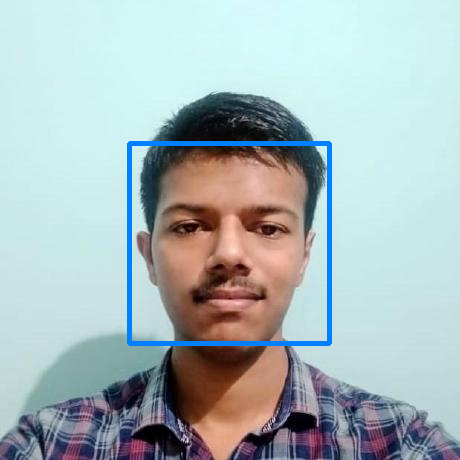
    


```python
# second face example
face2 = cv2.imread("images/group.jpg")
grey2 = cv2.cvtColor(face2,cv2.COLOR_BGR2GRAY)

applyface2 = face_cascade.detectMultiScale(face2, 1.3 , 5)
print(applyface2, "\n")
for (x, y ,w ,h) in applyface2:
  cv2.rectangle(face2, (x,y), (x+w, y+h),(110, 255, 0),3)

cv2_imshow(face2)
```

    [[ 961  170   52   52]
     [ 764  176   54   54]
     [ 520  177   55   55]
     [ 644  174   61   61]
     [ 189  149   70   70]
     [ 405  178   56   56]
     [ 854  203   57   57]
     [1057  216   58   58]
     [ 286  190   60   60]] 
    


    
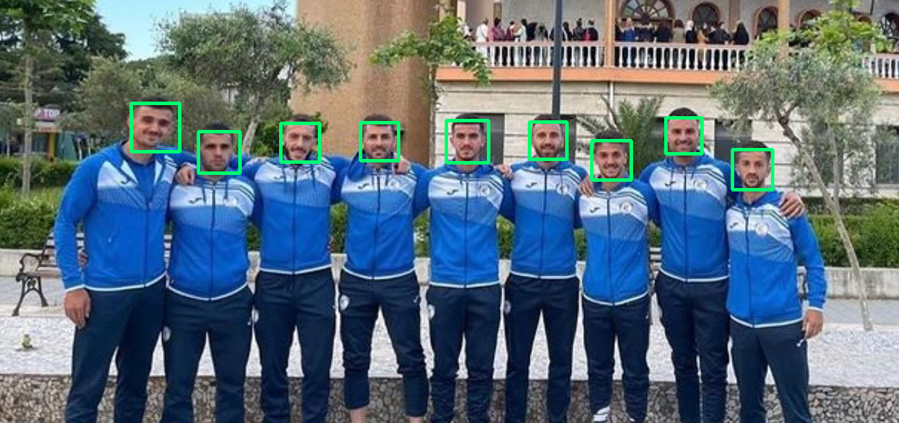
    


**Face recognising by comparing known and unknown image**


```python
!pip install face_recognition
```


```python
import face_recognition
import numpy as np
import cv2
from google.colab.patches import cv2_imshow

face_1 = face_recognition.load_image_file("images/face1.jpg")
face1_encoding = face_recognition.face_encodings(face_1)[0]

face2 = face_recognition.load_image_file("images/face2.jpg")
face2_encoding = face_recognition.face_encodings(face2)[0]

face3 = face_recognition.load_image_file("images/face3.jpg")
face3_encoding = face_recognition.face_encodings(face3)[0]

known_face_encoding = [
                    face1_encoding,
                    face2_encoding,
                    face3_encoding,
]

known_faces = [
           "Ajay",
           "Kevin",
           "John",   
]
```


```python
file_name = "images/unknown.jpg"

unknown_image = face_recognition.load_image_file(file_name)
unknown_image_to_draw = cv2.imread(file_name)

face_locations = face_recognition.face_locations(unknown_image)

face_encodings = face_recognition.face_encodings(unknown_image, face_locations)

for (top, right, bottom, left), faces_encoding in zip(face_locations, face_encodings):
  matches = face_recognition.compare_faces(known_face_encoding, faces_encoding)

name = "Unknown"

face_distances = face_recognition.face_distance(known_face_encoding, faces_encoding)
best_matching = np.argmin(face_distances)
if matches[best_matching]:
  name = known_faces[best_matching]
  cv2.rectangle(unknown_image_to_draw, (left, top), (right, bottom), (0,255,0), 3)
  cv2.putText(unknown_image_to_draw,name, (left, top-20),cv2.FONT_HERSHEY_COMPLEX, 1, (252, 244, 3), 3, cv2.LINE_AA)

cv2_imshow(unknown_image_to_draw)
```


    
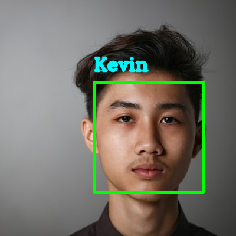
    

